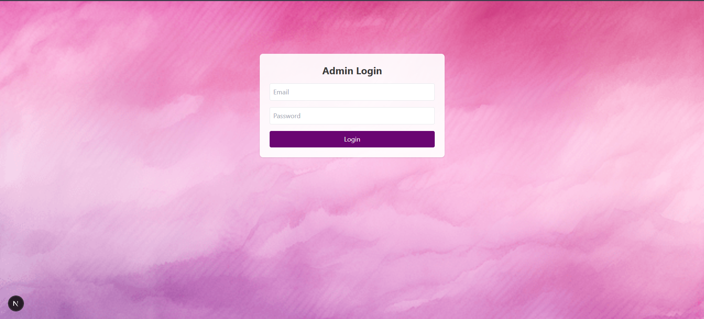
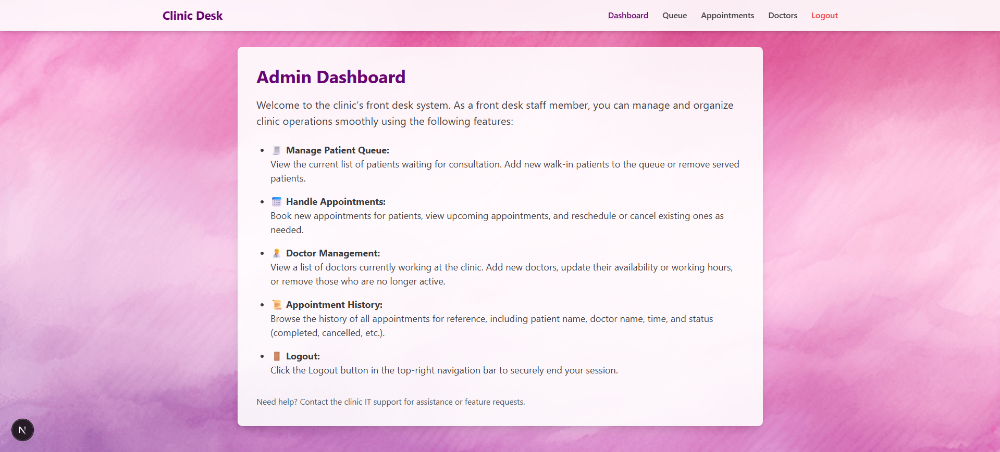
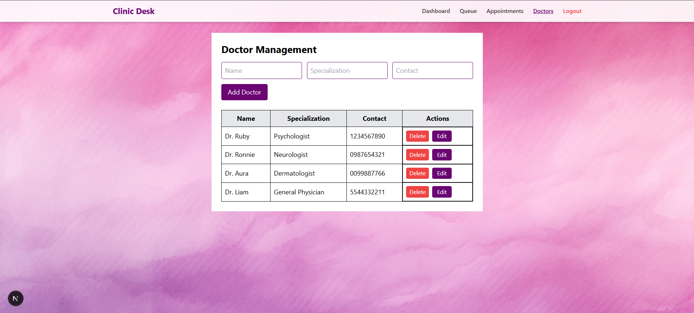
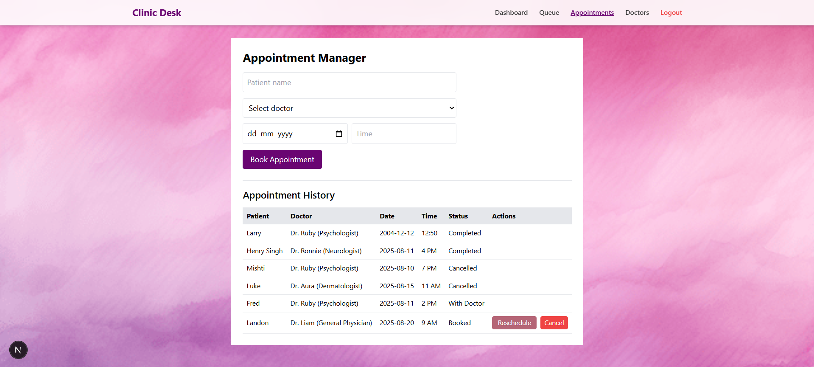
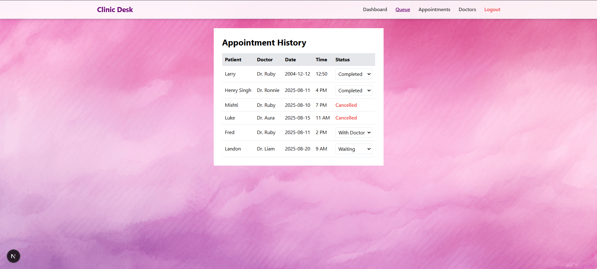

# 🏥 Clinic Front Desk - Full Stack Application

A complete clinic management web application for handling **doctor schedules**, **patient appointments**, and **queue management** with secure tokenized authentication.

---

## 📌 Tech Stack

**Frontend**
- Next.js (React)
- TailwindCSS
- JWT authentication

**Backend**
- NestJS
- TypeORM
- MySQL

---

## 🛠 Prerequisites

Before running the project, make sure you have:

- [Node.js](https://nodejs.org/) (v18+ recommended)
- [npm](https://www.npmjs.com/) or yarn
- [XAMPP](https://www.apachefriends.org/) (for MySQL + phpMyAdmin)

---

## 📂 Project Structure

```

clinic-frontdesk/
│
├── frontend/   # Next.js application
│   ├── src/
│   ├── package.json
│   └── ...
│
├── backend/    # NestJS API
│   ├── src/
│   ├── package.json
│   └── ...
│
└── README.md

````

---

## ⚙️ Setting up MySQL with XAMPP

1. **Install and open XAMPP**.
2. Start **Apache** and **MySQL** from the XAMPP Control Panel.
3. Open [phpMyAdmin](http://localhost/phpmyadmin/).
4. Create a new database:
   - Name: `clinic_db`
   - Collation: `utf8mb4_general_ci`
5. Your backend will automatically create the necessary tables when it runs for the first time.

---

## 🔐 Configure Backend Environment

In `backend/`, create a `.env` file:

```env
# App
PORT=3001

# Database
DB_HOST=localhost
DB_PORT=3306
DB_USER=root
DB_PASSWORD=your_password
DB_NAME=clinic_db

# JWT
JWT_SECRET=your_jwt_secret
JWT_EXPIRATION=1d
````

---

## ▶️ Running the Backend

```bash
cd backend
npm install
npm run start:dev
```

The backend will be available at:

```
http://localhost:3001/api
```

---

## 🖥 Running the Frontend

In another terminal:

```bash
cd frontend
npm install
npm run dev
```

The frontend will be available at:

```
http://localhost:3000
```

---

## 🔑 Default Authentication

* After starting both servers, sign up as a new user (or set up admin manually in DB if required).
* JWT authentication is used; token is stored in localStorage.

---

## 📋 Features with Images

### 1️⃣ Login Page

User authentication with JWT.



---

### 2️⃣ Dashboard

Quick access to key clinic management features.



---

### 3️⃣ Doctors Management

Add, edit, and delete doctor profiles.



---

### 4️⃣ Appointments Management

Book, reschedule, or cancel patient appointments.



---

### 5️⃣ Queue Management

Track patients in the waiting list and update their status.



---

## 🧪 Testing the Flow

1. **Login** as a user/admin.
2. **Add Doctors** in the doctors section.
3. **Book an Appointment** for a patient.
4. **Check Queue** — appointments should appear with status control.
5. **Update Status** to "With Doctor", "Completed", or cancel it from appointments.
6. **Check History** for completed appointments.

---

## ⚠️ Common Issues

* **404 API errors** → Make sure backend is running and `API_BASE` in frontend points to correct backend URL.
* **Database connection errors** → Ensure MySQL is running in XAMPP and credentials match `.env`.

## 📜 License

This project is open source and available under the [MIT License](LICENSE).

```
